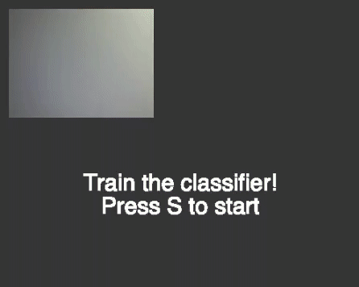

# QuizKNN
A Quiz game using KNN Image Classification

# How to Play
Press L to load a pretrained model  
Press S to start the quiz  
And now use your thumb up when the answer is true and thumb down when is not  

# How to Train
When you press T the algorithm takes that video frame as an example of what TRUE looks like  
When you press F the same things append but for FALSE  

# Example

